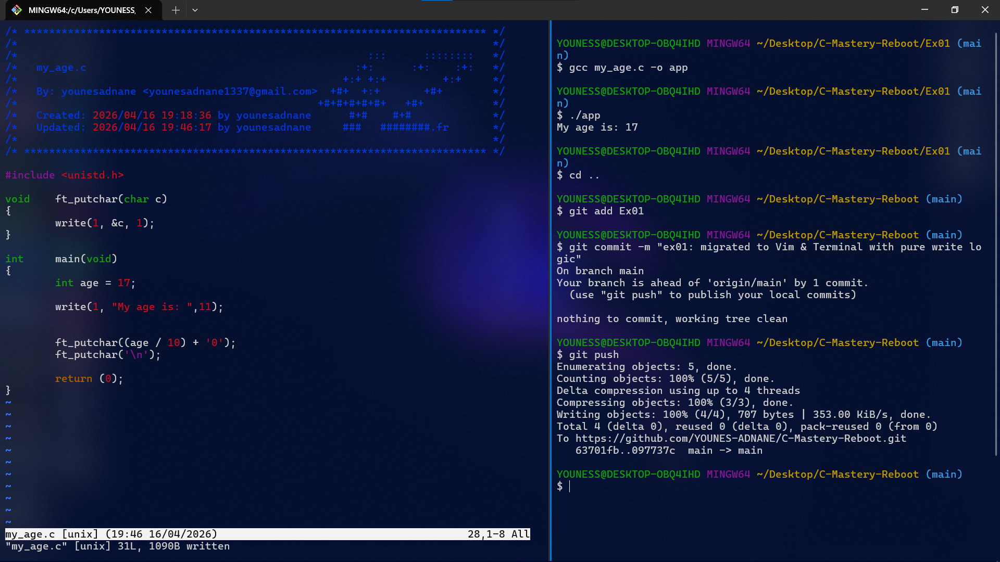

# Exercise 01: My Age Printer (ASCII Logic)

## 📝 Description
In this exercise, I moved away from VS Code to work exclusively in the **Terminal** using **Vim**. 
The goal was to display an integer value using only the `write` system call.

## 🛠️ Concepts Learned
- Manual **Integer to ASCII** conversion using `/` and `%`.
- Creating a helper function `ft_putchar`.
- Implementing the **42 Standard Header**.

## 🖼️ Proof of Work

## 💻 Compilation
`cc my_age.c -o app && ./app`
`
