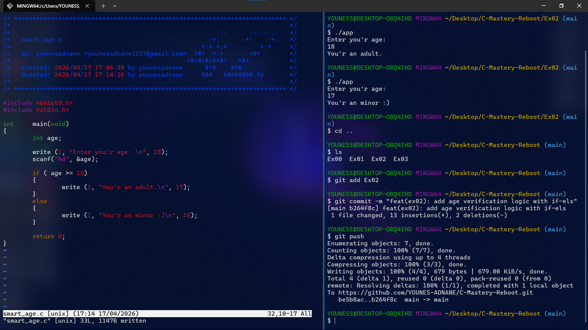

# Exercise 02: Smart Age Check

## 📝 Description
In this exercise, I implemented a conditional logic program. The goal was to take user input and decide whether the user is an **adult** or a **minor** using `if-else` statements.

## 🛠️ Concepts Learned
- Taking user input using **`scanf`**.
- Conditional logic with **`if`** and **`else`**.
- Using **`write`** to display different strings based on conditions.
- Proper use of `return (0)` to exit the program.

## 🖼️ Proof of Work

## 💻 Compilation
`cc smart_age.c -o app && ./app`
