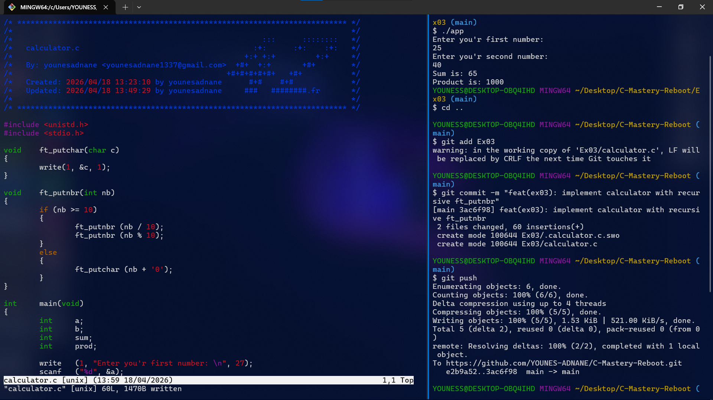

# Exercise 03: Simple Calculator (The Logic)

## 📝 Description
In this exercise, I built a smart calculator that takes two numbers from the user and calculates both the **Sum** and the **Product**. 
The main challenge was handling large results (like 18 * 17 = 306) without using `printf`.

## 🛠️ Concepts Learned
- Advanced **ft_putnbr** using **Recursion** to handle multi-digit numbers.
- Performing arithmetic operations (+, *) in C.
- Handling multiple user inputs with `scanf`.
- Clean code structure following the **42/1337 Standard**.

## 🖼️ Proof of Work

## 💻 Compilation
`cc calculator.c -o app && ./app`
