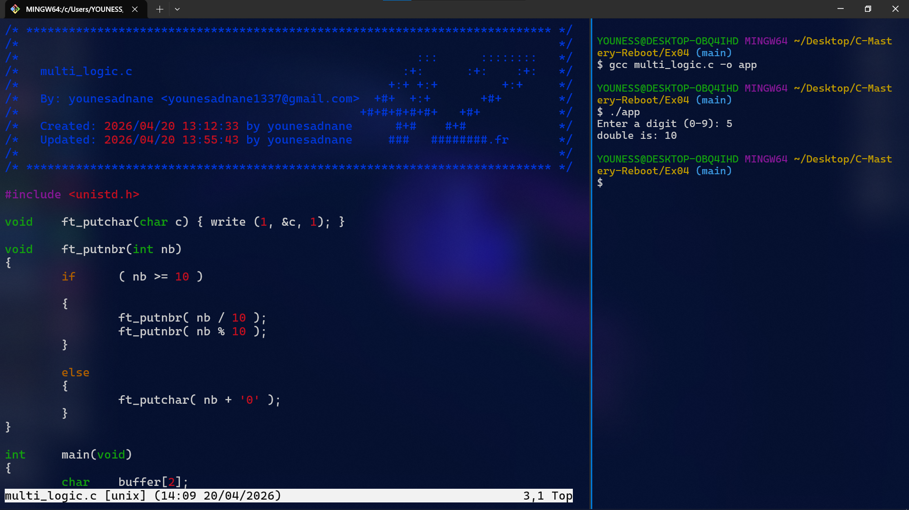

# Exercise 04: The "Read" Master (Input Logic)

## 📝 Description
In this final exercise of Level 1, I replaced the high-level `scanf` function with the low-level **`read`** system call. This is a crucial step towards understanding how data is handled in **Unix-like** systems and school **1337**.

## 🛠️ Concepts Learned
- Using the **`read`** system call (File Descriptor 0).
- Manual **ASCII to Integer** conversion (`char - '0'`).
- Handling user input as a buffer.
- Displaying results using a **recursive `ft_putnbr`**.

## 🖼️ Proof of Work

## 💻 Compilation & Usage
`cc multi_logic.c -o app && ./app`

