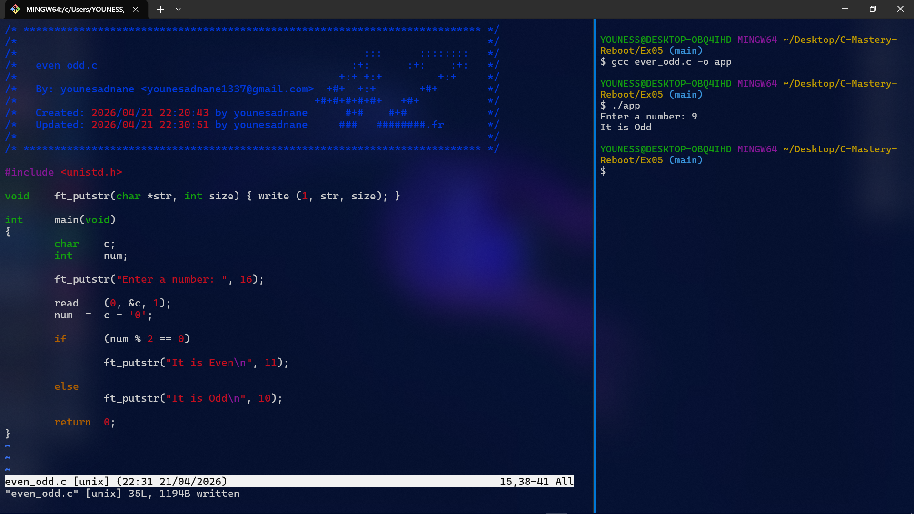

# Exercise 05: Even or Odd Master

## 📝 Description
In this exercise, I implemented a program that determines whether a given digit (0-9) is **Even** or **Odd**. 
The goal was to reinforce the use of the **`read`** system call and manual **ASCII-to-Integer** conversion.

## 🛠️ Concepts Learned
- Advanced use of **`read`** from Standard Input (File Descriptor 0).
- Creating a reusable helper function **`ft_putstr`** to display strings.
- Using the **Modulo operator (`%`)** for mathematical logic.
- Understanding the difference between ASCII characters ('0') and integer values (0).

## 🖼️ Proof of Work

## 💻 Compilation & Usage
`cc even_odd.c -o app && ./app`
