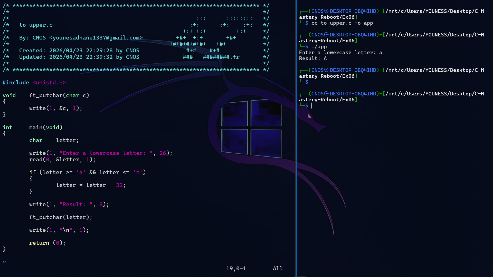

# Exercise 06: Uppercase Converter (ASCII Mastery)

## 📝 Description
In this exercise, I created a program that converts a **lowercase** character to **uppercase**. 
This was done by understanding the mathematical relationship between characters in the **ASCII table**.

## 🛠️ Concepts Learned
- **ASCII Math:** The 32-point difference between lowercase and uppercase letters (`'a' - 32 = 'A'`).
- **Validation Logic:** Using `if` statements to ensure only letters from `a` to `z` are modified.
- **Low-Level I/O:** Using `read` for input and `write` for output.
- **Helper Functions:** Reusing `ft_putchar` to maintain clean code.

## 🖼️ Proof of Work

## 💻 Compilation & Usage
`cc to_upper.c -o app && ./app`
